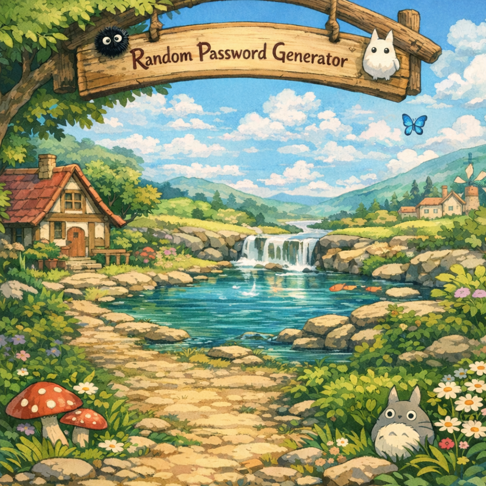

# WhimsyPassWords

A whimsical RPG-themed password generator built with **Flask** and vanilla JavaScript.



## Features

- **Three strength presets** — Easy, Medium, Hard
- **Fine-grained control** — adjust uppercase, lowercase, digits, special characters, and total length independently
- **Cryptographically secure** — uses Python's `secrets` module
- **RPG wooden-panel UI** — animated water shimmer, floating planks, responsive design
- **Copy to clipboard** — one-click copy with toast notification

## Quick Start

```bash
# 1. Install dependencies
pip install flask

# 2. Run the server
python app.py
```

Open **http://127.0.0.1:5000** in your browser.

## Project Structure

```
├── app.py                 # Flask backend & password generation API
├── templates/
│   └── index.html         # Jinja2 HTML template
├── static/
│   ├── style.css          # RPG-themed CSS with responsive breakpoints
│   ├── app.js             # Frontend logic (stepper controls, API calls)
│   └── passwordUI.png     # Background artwork
├── README.md
└── .gitignore
```

## API

### `POST /api/generate-password`

**Request body (JSON):**

| Field             | Type   | Default    | Description                          |
|-------------------|--------|------------|--------------------------------------|
| `strength`        | string | `"medium"` | `easy`, `medium`, or `hard`          |
| `total_length`    | int    | —          | Total password length                |
| `uppercase_count` | int    | —          | Number of uppercase letters          |
| `lowercase_count` | int    | —          | Number of lowercase letters          |
| `digit_count`     | int    | —          | Number of digits                     |
| `special_count`   | int    | `0`        | Number of special characters         |

**Response:**
```json
{ "password": "s*^54xK!8sxTCow6/xHyF&" }
```

## License

MIT
